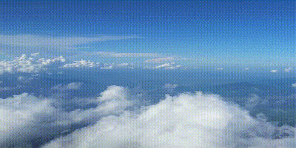

Finn Astle is a creative storyteller, writing and walking every day, this story covers four continents, roughly 2,000 days and many many people.

<video class="essay-clip" src="/writing/let-the-world-tell-your-story/01.mp4" poster="/writing/let-the-world-tell-your-story/01.webp" width="600" height="300" muted loop playsinline preload="none" aria-label="Bare feet walking across rippled red sand, the hem of a pale blue robe swinging above them."></video>

**All stories are part true and part myth. Anything we share is a story — even if it’s a fact.**

A fact is usually a story we agree on, or history’s winners do. Stories have heroes, villains, beginnings, middles and ends. My story gets less interesting to me the more I walk, listening to other people’s stories along the way. My story has been told before.

<video class="essay-clip" src="/writing/let-the-world-tell-your-story/02.mp4" poster="/writing/let-the-world-tell-your-story/02.webp" width="600" height="300" muted loop playsinline preload="none" aria-label="A long dark boat beached on ochre sand under a hazy sky."></video>

**Collective consciousness is an idea you might be familiar with**. It suggests that we as humans, as a species, share a primal evolutionary conscience or memory.

Millions of years of experience remembered into instincts, reactions, emotions, needs, desires, dreams. The fights and the flights — feelings we’ve had since we were born. Dreamers look up, scavengers look down.

<video class="essay-clip" src="/writing/let-the-world-tell-your-story/03.mp4" poster="/writing/let-the-world-tell-your-story/03.webp" width="600" height="300" muted loop playsinline preload="none" aria-label="Close on broken red desert rock, stacked and split."></video>

**All stories really begin within yourself, **no matter the country, situation or language, your mind will be the first part of you to translate your experience. Like our lives, stories start and end, we are the narrator to ourselves.

Collectively we build cities, on our own, we build a life.

<video class="essay-clip" src="/writing/let-the-world-tell-your-story/04.mp4" poster="/writing/let-the-world-tell-your-story/04.webp" width="600" height="300" muted loop playsinline preload="none" aria-label="An aerial black-and-white view of a freeway interchange threading between city towers, traffic crawling across it."></video>

**Life is a story that’s difficult to write sometimes** and if you’re not careful the world will write it for you. Putting your words, plot points and character development into the framework of a city, civilisation and laws.

While we’ve started telling stories with modern media, our structures and plans were represented in this same consciousness million years ago, advertising, cave paintings, TV’s, fire, monuments and mountains.

In the world I was living, death occurred next to me, taken by a train. So I went searching for life in other world’s.

<video class="essay-clip" src="/writing/let-the-world-tell-your-story/05.mp4" poster="/writing/let-the-world-tell-your-story/05.webp" width="600" height="300" muted loop playsinline preload="none" aria-label="Three pale mountain peaks against a deep rust-red sky."></video>

**When you are on the way to something,** have you ever noticed how the way there feels so much longer — than the way back?

Expectation creates excitement and travelling in new worlds you see new things, new representations, new translations. At their core the structures, languages, or representations, while new, remain all too familiar.

<video class="essay-clip" src="/writing/let-the-world-tell-your-story/06.mp4" poster="/writing/let-the-world-tell-your-story/06.webp" width="600" height="338" muted loop playsinline preload="none" aria-label="A statue of two rearing horses silhouetted against a hazed city skyline across water, a colonnade running behind it."></video>

**Memory plays our lives back to us.**

As we talk and listen to other people’s stories our mind uses memory to put it all together. As you’ve been reading the images, words and sentiment my memory has conjured to tell my story, you’ve been writing your own subconsciously.

<video class="essay-clip" src="/writing/let-the-world-tell-your-story/07.mp4" poster="/writing/let-the-world-tell-your-story/07.webp" width="600" height="338" muted loop playsinline preload="none" aria-label="A lone signboard on a tripod standing in an empty desert of dunes."></video>

**I’m going to stop talking and listen.**

Get perspective and look at the clouds, they don’t judge you, they are objective, they don’t have memories.

I am trying to take the time to pause, and really listen to what the clouds, mountains, sun and sky are saying more. Trying to find where the simplicity, the purposeless beauty, the calm existence of nature, exists in my narrative.

[I think more about futures here](http://finnastle.com/).

Thank you for thinking now.
