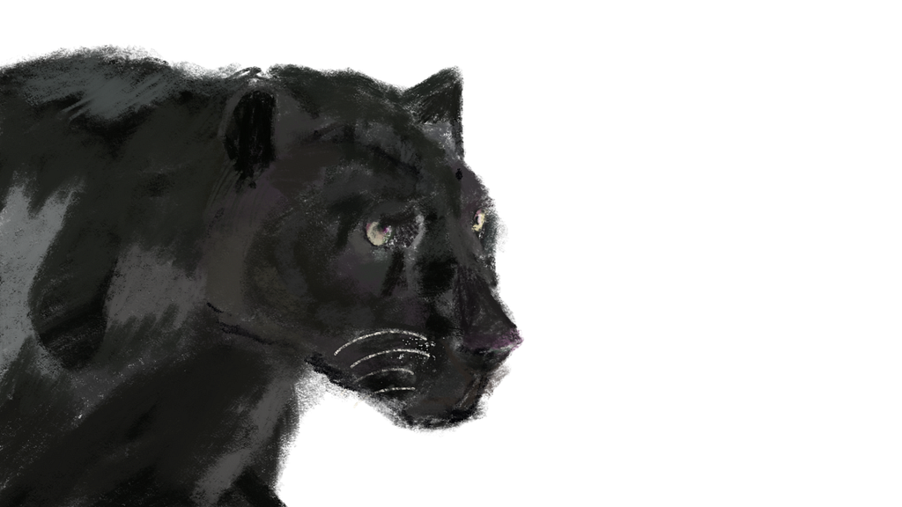
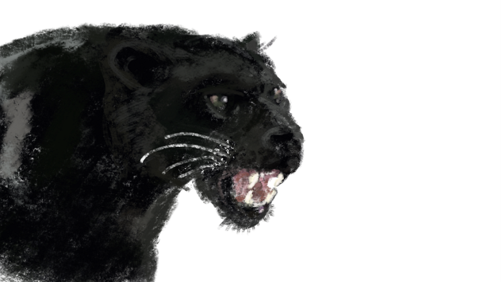

Playing around with new technology and learning new things always excites me. I’ve recently been using a tool called [E](https://ebsynth.com/)B SYNTH, it uses artificial intelligence and automation to turn your art into dynamic animation based on a video input.

To understand what’s possible here’s an example of the images I input and the result:

Using these two ‘Keyframes’, you can use image recognition technology, EB synth and a video editing tool to create your own automated animations.

### Here’s how it brings it all to life:
<video class="essay-clip" src="/writing/art-meets-ai/04.mp4" poster="/writing/art-meets-ai/04.webp" width="600" height="338" muted loop playsinline preload="none" aria-label="The finished EbSynth animation: the painted panther prowling, the brushwork holding its texture as the head turns."></video>

### Cool right?
If you want to start using EB synth yourself you can [download the program online](https://ebsynth.com/), here’s a handy tutorial I used [to get started](https://www.youtube.com/watch?v=B_bfDgJGEv8), along with some help from my coworkers at [VERSA.agency.](http://versa.agency)

Thanks for reading, check out some of my other cool animation work at [astlecreative.com](http://www.astlecreative.com)
